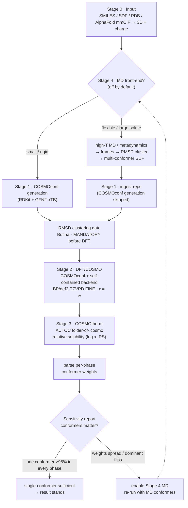

# Conformer-resolved COSMO-RS workflow

Scientific and operational reference for the **`cosmors`** pipeline: from a single
solute to **conformer-resolved COSMO-RS relative solubility**, with an explicit,
data-driven decision on whether conformational averaging changes the answer.

This is the **conformer-resolved** path. It is independent of and additive to the
legacy single-geometry workflow in [`workflow.md`](workflow.md) (whole-molecule,
one `.cosmo` per solute); nothing there is modified or called. The build plan and
phase status live in [`conformer-pipeline-plan.md`](conformer-pipeline-plan.md).

Status tags below: **[real]** runs for real in the sandbox, **[mock]** stubbed
pending its phase, **[HPC]** real only on the licensed cluster.

---

## Overview

**Execution order vs numbering.** Stage 4 (MD) is numbered as the optional *front
end* but, when enabled, runs **before** Stage 1: for flexible or folded solutes MD
is the conformer *source* and COSMOconf's own generation is skipped. For small,
rigid solutes MD stays off and COSMOconf generates conformers directly.

---

## Scientific rationale

**Why conformers at all.** A COSMO-RS property is a Boltzmann average over the
solute's conformers, taken **separately in each phase**. Each conformer has its own
COSMO σ-profile, so its screening free energy — and therefore its weight — differs
between gas, water, and each solvent. A rigid solute is one geometry; a flexible
peptide is an ensemble whose composition can shift from phase to phase. Ignoring
that shift silently biases the predicted solubility.

**ε = ∞ (ideal conductor).** Every `.cosmo` is generated with COSMO at **infinite
permittivity** — the solute polarised by a perfect conductor. This is the defining
COSMO-RS separation: the quantum step produces a *solvent-independent* ideal-screening
surface, and COSMOtherm reconstructs real-solvent thermodynamics from those surfaces.
Solvent-specific COSMO geometries would break σ-profile consistency and are **never**
generated. The pipeline enforces `theory.cosmo_epsilon = infinity` in code.

**AUTOC conformer treatment.** In Stage 3 the solute is one compound defined by the
**whole folder** of conformer `.cosmo` files (`f="c1.cosmo" f="c2.cosmo" … autoc`).
COSMOtherm Boltzmann-weights them per phase from the COSMO energies plus gas-phase
energies supplied via the `.energy` / **EHfile** convention. The per-phase weights it
returns are exactly the input to the sensitivity report.

**Relative solubility (log x_RS).** The target property is *relative* solubility on
COSMOtherm's solute-referenced scale (`relative`), water as the reference. This is
deliberately **DG_fus-free**: it needs no melting point or heat of fusion, which are
ill-defined for a peptide like bombesin, so absolute crystalline solubility is out of
scope. Relative solubility, activity coefficients, and chemical potentials are the
well-posed conformer-weighted observables.

**RMSD gate before DFT.** Re-optimising near-identical geometries is the dominant
cost. The pipeline clusters conformers by symmetry-aware RMSD (RDKit Butina) and keeps
one representative per cluster **before** any DFT runs — a hard, enforced gate, not an
optional cleanup.

**MD proposes, DFT and COSMOtherm decide.** The MD front-end only *proposes*
geometries. Every kept geometry is re-optimised at the DFT/COSMO level in Stage 2, and
**COSMOtherm — never the MD populations —** assigns the final Boltzmann weights. MD
widens the conformer search; it does not set the thermodynamics.

---

## Stages

### Stage 0 — Input  **[real]**
SMILES / SDF / PDB / **AlphaFold mmCIF** → normalised 3D geometry + total charge
(RDKit; explicit-config charge overrides the RDKit formal charge; PROPKA-derived charge
for titratable proteins). For AlphaFold models the intake applies a per-residue **pLDDT
confidence gate** and grafts non-standard residues onto the AF Cα trace (ported
self-contained from `prepare_alphafold.py`), then treats the folded model as a **seed
for the Stage 4 MD front-end** rather than a final geometry. Emits `geometry.xyz`,
`charge.txt`, `input.sdf`, provenance metadata. Run: `cosmors input`.

### Stage 4 — MD front-end  **[frames/clustering real; MD engine optional/HPC]**
High-temperature MD or metadynamics (OpenMM in-sandbox; GROMACS adapter on HPC) →
frame extraction → RMSD clustering (Butina) → cluster representatives as a
multi-conformer SDF. The conformer source for flexible/large solutes; **off by
default**, enabled when the sensitivity report says conformers matter.
Run: `cosmors md`.

### Stage 1 — Conformer generation / ingest  **[ingest: real; generation: HPC → P4]**
Either COSMOconf's built-in generation (RDKit + GFN2-xTB + RMSD, for small/rigid
solutes) **or** ingest of the MD representatives with generation skipped (peptides).
Packages the geometries as conformers of one compound. Emits `ensemble.sdf`.
Run: `cosmors confgen`.

### RMSD clustering gate  **[real]**
Mandatory Butina dedup on `ensemble.sdf`: energy-window pre-filter, RMSD clustering
at `conformers.rmsd_cutoff`, one representative per cluster, hard `max_conformers`
cap. Only the kept set reaches DFT. Emits `kept.sdf`, `clusters.json`.
Run: `cosmors cluster`.

### Stage 2 — DFT / COSMO  **[real; binaries on HPC]**
COSMOconf orchestrates the TURBOMOLE cascade (BP/def2-TZVP opt + clustering →
BP/def2-TZVPD-FINE single point) driven by a **self-contained `turbomoleio` backend**
(no dependency on the legacy `scripts/*.sh`). All `.cosmo` at **ε = ∞**. Bombesin is
well-conditioned → stock single-point SCF; the hardened TZVP→TZVPD bootstrap + annealed
Fermi path is self-contained too and added when a lysozyme-class solute needs it.
Output: a reduced set of `.cosmo` / `.energy`. Run: `cosmors dft`.

### Stage 3 — COSMOtherm  **[input builder: real; execution: HPC]**
Builds the conformer-resolved input: AUTOC folder-of-`.cosmo`, gas-phase energies via
EHfile, `relative` (+ `force_qspr` for pure solvents) matching the existing
`protocols/cosmotherm-screen/*.tmpl`. The crystallization panel is resolved to
COSMObase names and **v/v → mole fractions** for the aqueous binaries; solvents absent
from the COSMObase are dropped and reported. Emits `pure-screen.inp`, `mix-*.inp`,
`solvents.list`, `runme.sh`. Run: `cosmors cosmotherm`.

### Sensitivity report  **[real]**
Parses the per-phase conformer weights and applies the decision gate (below). Emits
`sensitivity.json` and a human-readable `sensitivity.txt`. Run: `cosmors sensitivity`.

Full pipeline: `cosmors run` (add `--mock` or `--dry-run` in the sandbox).

---

## The decision gate — is the MD front-end worth running?

The sensitivity report reduces the per-phase weight table to one verdict:

- **single-conformer sufficient** — one conformer exceeds the threshold
  (`single_conformer_threshold`, default 0.95) in **every** phase. The dominant
  geometry is phase-invariant; MD is unlikely to change the ranking. Result stands.
- **conformers matter — dominant flips** — the highest-weight conformer differs
  between phases (e.g. gas vs water vs target solvent). Phase-dependent conformer
  selection is real → enable Stage 4.
- **conformers matter — spread** — no single conformer dominates in some phase.
  The ensemble is genuinely multi-conformer → enable Stage 4.

This gate is the whole point of running Stage 3 first on whatever conformers are
cheapest to obtain: it tells you, from COSMOtherm's own weights, whether the expensive
MD search is justified for *this* solute.

---

## Sandbox vs HPC

The commercial binaries (TURBOMOLE, COSMOconf, COSMOtherm) are license-locked and run
only on the VSC cluster / workstation. In this sandbox:

- **Real:** Stage 0, Stage 1 ingest, the RMSD gate, the Stage 3 input builder, and the
  sensitivity logic — all pure-Python/RDKit, fully unit-tested.
- **`--mock`:** binary-dependent stages (MD, DFT, COSMOtherm execution) emit clearly
  labelled synthetic artifacts (`.mock.` filenames, MOCK banners). No scientific
  numbers are fabricated for real molecules.
- **`--dry-run`:** every stage prints the exact command it would run on the cluster and
  writes nothing.

OpenMM MD (Stage 4) is the one binary-free stage that will also run for real in-sandbox
on small test systems. On the HPC, `runme.sh` and the rendered TURBOMOLE inputs execute
the real cascade.

---

## Configuration

All environment- and chemistry-specific values live in `config/config.template.yaml`
(copy to `config/config.yaml`); any scalar is overridable by `COSMORS_<SECTION>_<KEY>`.

| knob | meaning |
|------|---------|
| `theory.cosmo_epsilon` | must be `infinity` — enforced (ideal conductor) |
| `ctd.default` / `ctd.licensed` | COSMOtherm parametrisation (default `BP_TZVPD_FINE_25.ctd`) |
| `conformers.rmsd_cutoff` / `energy_window` / `max_conformers` | the RMSD gate |
| `md.enabled` / `engine` / `method` / `temperature_K` | Stage 4 front-end |
| `cosmotherm.property` | `relative_solubility` (only supported target) |
| `cosmotherm.solvent_panel` | the crystallization panel (`config/solvent_panel.yaml`) |
| `cosmotherm.single_conformer_threshold` | sensitivity gate (default 0.95) |
| `paths.*` | TURBOMOLE / COSMOconf / COSMOtherm binaries + `.ctd` / license / COSMObase dirs |

---

## Implementation status

| stage | module | status |
|-------|--------|--------|
| 0 Input | `stage0_input.py`, `af_intake.py` | real (P2 + AlphaFold intake P5a) |
| 4 MD front-end | `stage4_md/` | frames/clustering real (P5); OpenMM/GROMACS engine optional/HPC |
| 1 Confgen / ingest | `stage1_confgen.py` | ingest real (P2); COSMOconf generation on HPC |
| RMSD gate | `cluster.py` | real (P2) |
| 2 DFT / COSMO | `stage2_dft/` | real (P4); TURBOMOLE/COSMOconf run on HPC |
| 3 COSMOtherm | `stage3_cosmotherm/` | input builder real (P3); execution HPC |
| Sensitivity | `parse.py`, `sensitivity.py` | real (P3) |

---

## Relationship to the legacy pipeline

`workflow.md` describes the whole-molecule, single-conformer TURBOMOLE-COSMO pipeline
that already produces one `.cosmo` per solute and its hard-won SCF-convergence
engineering (TZVP→TZVPD bootstrap, annealed Fermi, crash-safe SLURM). This
conformer-resolved pipeline reuses the same **scientific lineage** — BP-TZVPD-FINE,
COSMO ε = ∞, COSMOtherm relative solubility — but adds the conformer layer around it and
is packaged independently (`cosmors/`). The two coexist; neither touches the other.
