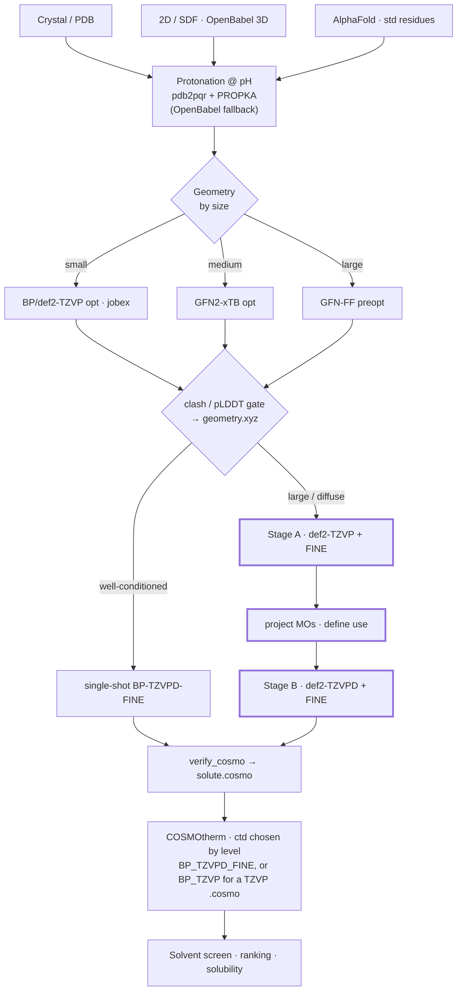

# COSMO-RS solute workflow

End-to-end pipeline for producing a **BP-TZVPD-FINE `.cosmo`** per solute and screening
solvents with COSMOtherm / COSMO-RS.

The **spine is fixed** — structure → protonation → geometry → DFT-COSMO `.cosmo` →
COSMOtherm screen. Everything downstream of `verify_cosmo` is identical regardless of how
the `.cosmo` was produced. Only **two stages branch by molecule size**: geometry prep and
the SCF.

## Pipeline

The highlighted boxes (`Stage A → project MOs → Stage B`) are the large-protein path —
the bootstrap. Everything else is the route the three small solutes already took.

## Decision point 1 — geometry (by size)

The `.cosmo` is a **single point**; the geometry only has to be physically sensible
(no clashes/strain, sane polar-H positions), not DFT-optimal. So use the cheapest method
that is still adequate:

| size | method | rationale |
|------|--------|-----------|
| small (≲300 atoms) | **BP/def2-TZVP opt** (TURBOMOLE `jobex`), optional GFN2-xTB warm-start | the textbook COSMOtherm recipe; affordable at this size |
| medium | **GFN2-xTB opt** | good non-covalent / H-bond geometry, orders of magnitude cheaper than DFT |
| large (≳1500 atoms) | **GFN-FF preopt** | DFT optimization is infeasible (one SCF ≈ 100 min on lysozyme); GFN2 SCC is unstable at this size |

Then a **clash check** (min interatomic distance) and, for AlphaFold inputs, a **pLDDT
gate** before the single point.

## Decision point 2 — SCF / `.cosmo` (by conditioning)

| case | path |
|------|------|
| well-conditioned (small/mid, few-thousand basis functions) | **single-shot BP-TZVPD-FINE** (`ridft` + COSMO) |
| large / diffuse-heavy (`def2-TZVPD` overlap near-singular, e.g. lysozyme: 46 340 BF) | **TZVP→TZVPD bootstrap** |

### Why the bootstrap (large proteins)

`def2-TZVPD`'s diffuse functions on a folded protein make the AO overlap matrix
**near-singular**. TURBOMOLE's SCF modules (`ridft`/`dscf`) have **no** linear-dependence
projection (only `riper`/`lsdiag`, periodic-oriented), so a cold EHT guess detonates the
density — `NORM[dD]` ≈ 10¹⁰, 1e/2e energies in the millions, SCF diverges on iteration 1.
Fermi smearing (constant *or* annealed) does not fix this — it treats a small-gap problem,
not a singular overlap.

The fix is the **documented two-stage TZVPD-FINE recipe**:

1. **Stage A** — `BP/def2-TZVP + FINE COSMO` (no diffuse → well-conditioned overlap →
   converges like the small solutes). Yields a converged `mos` **and** a valid TZVP
   `.cosmo` fallback. Protocol: `BP-TZVP-FINE-ANNEAL` (annealed Fermi net as a harmless
   safety net).
2. **project MOs** across basis sets via `define`'s `use` command.
3. **Stage B** — `BP/def2-TZVPD + FINE COSMO` single point started from the projected,
   near-converged density → small first step → stays physical → the deliverable
   `.cosmo`. Protocol: `BP-TZVPD-FINE-ANNEAL-BOOT` — the only protocol whose `define.in`
   carries the `use ../BP-TZVP-FINE-ANNEAL/control` line that performs the projection.
   That path is relative, so Stage B runs only with Stage A's directory sitting beside it
   inside `molecules/<mol>/`.

The SLURM template is **crash/timeout-safe**: it checkpoints `ridft.out` every 5 min and
saves a warm-restartable `mos` via `#SBATCH --signal=B:TERM@600`, so a resubmit *continues*
the SCF instead of cold-starting.

**Status (2026-08):** the bootstrap has **not** converged lysozyme (+11, 46 340 BF). Stage A
converges and its TZVP `.cosmo` is the reported lysozyme result; every route to TZVPD —
MO projection, mixed basis, heavy damping, tight `$scftol`, plain TURBOMOLE defaults —
diverged. The ladder and what each rung changed is in
[`protocol-experiments.md`](protocol-experiments.md). Stage B is kept as the escalation
path for mid-size peptides, where a cold TZVPD guess fails but the overlap is not as
ill-conditioned as a whole protein's.

> This combines a **standard method** with a system size at the **upper edge** of what is
> usually reported for whole-structure COSMO-RS on proteins (~1000 atoms). The recipe is
> not novel; the scale is the challenge. Literature alternatives — fragmentation or
> linear-scaling DFT — would break σ-profile/parameterization consistency with the other
> three solutes, so whole-molecule BP-TZVPD-FINE is the route that keeps them comparable.

## Intake notes

- **Crystal / PDB** — clean first (drop waters, ions, alt-conformers; select chains), then protonate.
- **2D / SDF** — OpenBabel 3D generation.
- **AlphaFold** (mmCIF) — `scripts/prepare_alphafold.py <model.cif> <mol> [--template <sdf>]`.
  Parses per-residue pLDDT (confidence gate). AF only emits the 20 standard residues, so for
  non-standard chemistry pass `--template`: the validated solute (right bonds/H, closed rings)
  is bent onto the AF **Cα trace** — backbone matched N→C by a SMARTS walk (symmetry-free, no
  MCS), Cα pinned, side chains + termini + H relaxed (constrained MMFF). bombesin: grafts the
  N-terminal **pyroglutamate** lactam + **C-terminal amide** from `bombesin.sdf`, preserving
  formula C₇₁H₁₁₀N₂₄O₁₈S / charge 0 — same molecule as the SDF prep, AF conformer. Then
  xtb preopt → `.cosmo`, identical downstream. AF makes the *structure* free, not the *DFT* —
  a protein-sized AF model still inherits the large-protein bootstrap path.

## Protonation

- **pdb2pqr + PROPKA** at the target pH is the default for structure inputs (writes
  `charge.txt`, which is gitignored/generated).
- **OpenBabel** fallback for non-standard residues.
- Current solute charges: **lysozyme +11** (PROPKA, pH ≈ 4.6), **bombesin 0**,
  **vancomycin +2** (pH 2.6), **vancomycin_2d 0**.

## Protocols & scripts (repo)

- `protocols/BP-TZVPD-FINE` — single-shot deliverable level.
- `protocols/BP-TZVPD-FINE-ANNEAL` — annealed Fermi net (large/charged systems), cold EHT guess.
- `protocols/BP-TZVP-FINE-ANNEAL` — **Stage A** base for the bootstrap (no diffuse functions).
- `protocols/BP-TZVPD-FINE-ANNEAL-BOOT` — **Stage B**, projects Stage A's MOs (`define use`).
- `protocols/cosmotherm-screen` — Phase 7 screen.
- **Protocol names are load-bearing.** `_tune_scf.sh` matches `*FINE-ANNEAL*` to pick the
  annealed Fermi flavor, and `cosmotherm_screen.sh` picks the COSMOtherm parameterization
  and solvent database from the `BP-TZVP-*` / `BP-TZVPD-*` prefix. Renaming a protocol
  directory changes the method silently.
- Scripts: `prepare_molecule.py`, `prep_cosmo.sh`, `submit_cosmo.sh`, `_tune_scf.sh`
  (SCF tuning + Fermi flavor), `verify_cosmo.sh`, `cosmotherm_{setup,screen,postprocess}`.

## Infra

- Cluster: **Wice** (KU Leuven VSC tier-2), `bigmem` partition (72 cores / 2 TB / 72 h),
  account `lp_cheme_cfd`. **TURBOMOLE 7.8**; COSMOtherm installed for the screen.
- Sync: **edit on the Mac → `git push` → `git pull` on the cluster** (never edit on the cluster).
